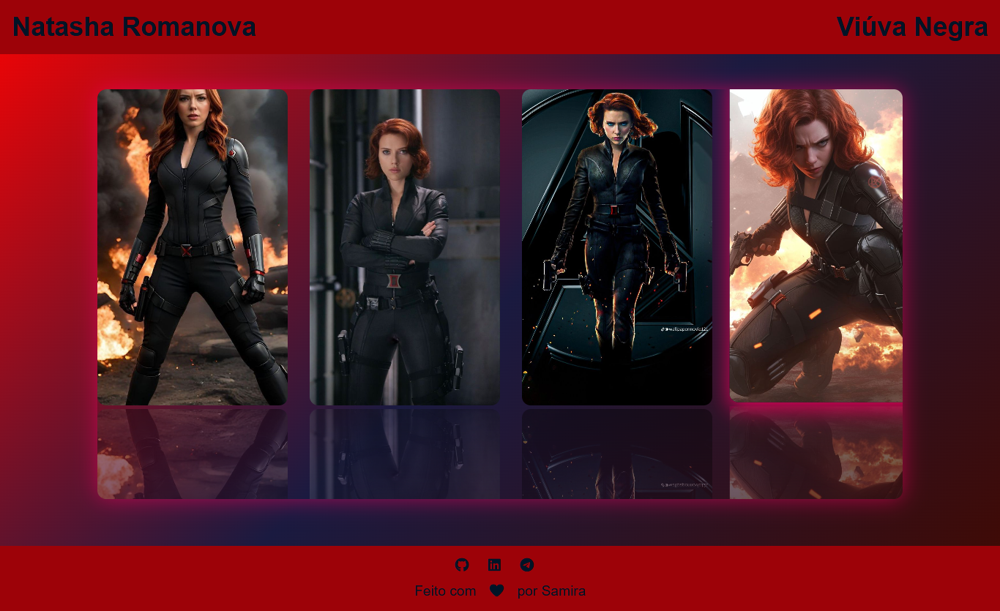

# 🕷️ Carrossel da Viúva Negra

Um carrossel inovador inspirado na **Viúva Negra**, com efeito 3D, reflexo nas imagens, hover interativo e autoplay infinito. Ideal para portfólio de front-end e projetos visuais modernos.  

---

## 🔥 Funcionalidades

- **Autoplay infinito:** slides mudam automaticamente.   
- **Reflexo abaixo das imagens:** efeito realista e elegante.  
- **Responsivo:** funciona em desktop e mobile.  
 

---

## 📂 Estrutura do Projeto

hulk-carousel/ 
│ 
├── assets/ 
│ ├── img/ # Imagens do Hulk 
│ └── gif/ # GIF do carrossel em ação 
│ 
├── index.html # HTML principal 
├── style.css # CSS do carrossel 
└── main.js # JS do carrossel 

---

# Demonstração

---

## 🚀 Tecnologias

  
  
  

---

## 🌐 Acesso Online

Confira o carrossel no seu navegador através do **GitHub Pages**:  

[🔗 Ver Projeto](https://seu-usuario.github.io/projeto-viuva-negra)  

---

## ❤️ Autor

Feito com ❤️ por **Samira Santos da Fonseca**  

  
  